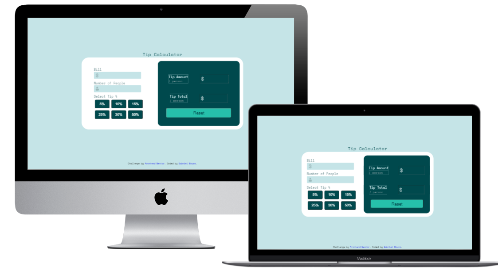

# Frontend Mentor - Tip calculator app solution

This is a solution to the [Tip calculator app challenge on Frontend Mentor](https://www.frontendmentor.io/challenges/tip-calculator-app-ugJNGbJUX).

## Table of contents

- [Frontend Mentor - Tip calculator app solution](#frontend-mentor---tip-calculator-app-solution)
  - [Table of contents](#table-of-contents)
  - [Overview](#overview)
    - [The challenge](#the-challenge)
    - [Screenshot](#screenshot)
    - [Links](#links)
  - [My process](#my-process)
    - [Built with](#built-with)
    - [What I learned](#what-i-learned)
  - [Author](#author)
    - [Get in touch](#get-in-touch)

## Overview

### The challenge

Users should be able to:

- View the optimal layout for the app depending on their device's screen size
- See hover states for all interactive elements on the page
- Calculate the correct tip and total cost of the bill per person

### Screenshot

### Links

- Enjoy my project: [Tip Calculator](https://newtipcalculator.netlify.app/)

## My process

### Built with

- HTML5
- CSS3 
- Javascript

### What I learned

I put into practice my knowledge of HTML5 and CSS3 to develop this application, using semantic tags and media query for styling the mobile version. In addition, I put my previous knowledge in Javascript into practice.

## Author

### Get in touch
- Portfolio - [Gabriel Moura](https://gcmoura-portfolio.netlify.app/)
- Linkedin - [Gabriel Moura](https://www.linkedin.com/in/gabriel-moura-developer/)
- Github - [@GCMoura](https://github.com/GCMoura)
